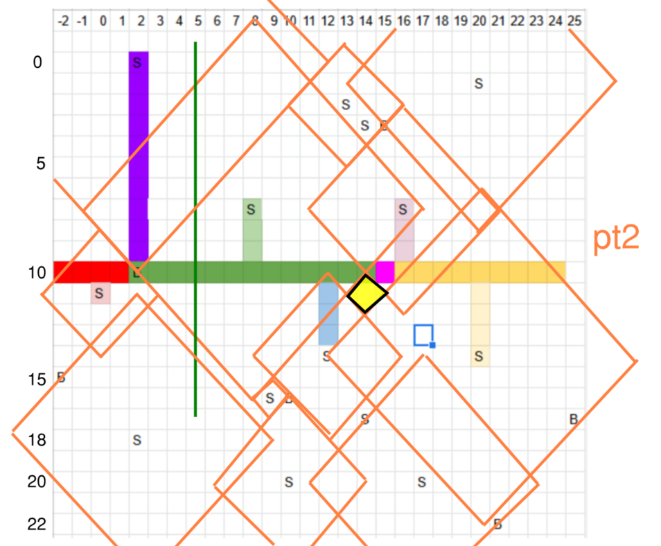

# Do triangles
First part take y dist to the line. Ignore if a sensor does not reach. If it reaches the add the width of the diamond (2 triagnles) at that distance along the diamond.

Second part just check edges of all diamonds. Get the lines representing the edges and shift up or down. In retrospect the space could be reduced further if only the intersection of these lines with other diamond edges was done. 

