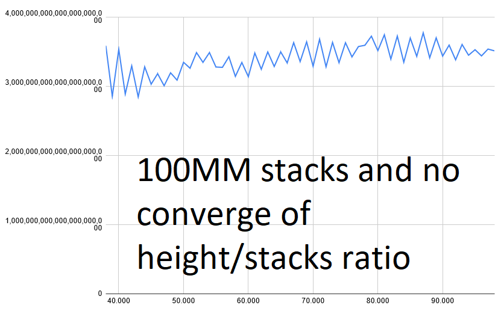

# P1

Roughed out implementation in sevent.py worked on the day for p1 answer.

# P2

Should repeat the pattern eventually. 10091 right/left moves and 5 shapes. 50K configurations not including the variation of the stack being dopped onto. ("floor" may be different every time to 50K rotation occurs)

# Check for a converging of the ratio of height/stacks ran:
Ratio jumped around within the same rought 1000 or so during this check. Can't check them all so not useful. (below shows the variation in part of the end of the decimal representation of the ratio)

# P2 (again)

1: Go gridless. Only remember the last X lines of the stack (30/40/50?)
2: DP it with this X line state as a set of rock rock positions/height of tallest rock/current jet

or KMP compare an arbitrary section through the next Y million lines to find the recurring pattern?