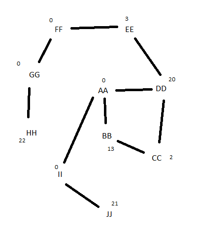
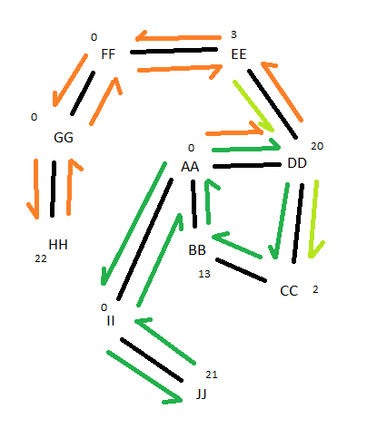

# Attemp 1
Greedy DFS type pathfinding attempt. Just got stuck. won't work in the end anyway

# Attempt 2
- Need to find the best path given 30 "steps" (minutes) cost of traversal is 1 cost of releasing the value is 1. Value weight is valve pressure * steps remaining.
- Valves can be passed over and ignored to prevent spending 1 step. to reach better valves

- pt1 to implement: compute the best cost out of all the available nodes:
    - from the node currently on:
        - calculate the steps to any other node. (BFS should work)
        - multiply its pressure value * remaining steps
        - Pick this node and travel to it and activate it. (AFAIK don't touch anything while moving so this step could just be add the steps and set the node to the target)
        - repeat.

